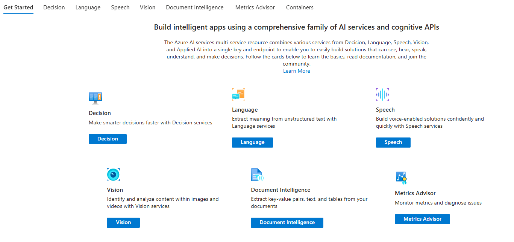
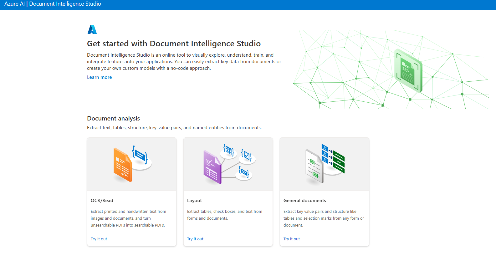
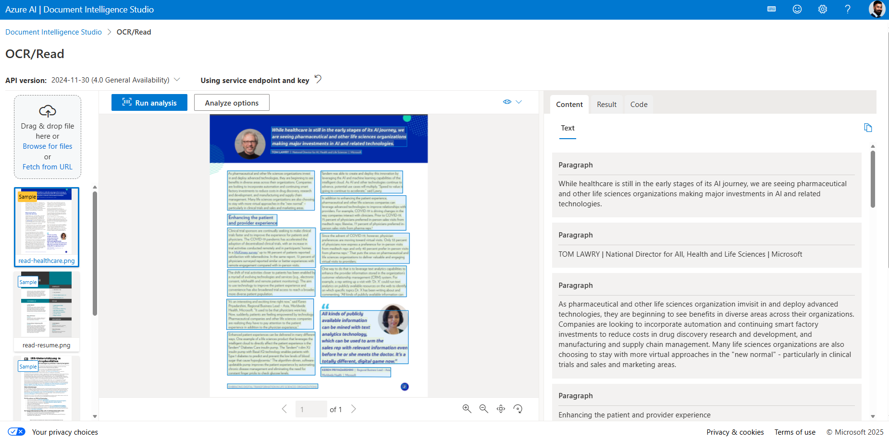

## Lab 1: Azure AI Multi‑Service & Document Intelligence Quickstart

Welcome to Lab 1! 

This is a zero‑code, 10‑minute exploration of Azure AI using the Cognitive Services *multi‑service* resource and the online Document Intelligence.

---
### 🎯 What You Will Do
1. Create (or locate) an Azure AI multi‑service (Cognitive Services) resource.
2. Open the Document Intelligence Studio and run an OCR/Read analysis.
3. Understand where to find the endpoint and key (but do NOT paste real keys in files).
4. Prepare for Lab 2 where we start writing code.

---
### ✅ Prerequisites
| Requirement | Notes |
|-------------|-------|
| Azure Subscription | Any pay‑as‑you‑go or enterprise sub with resource create rights |
|  Resource | Cognitive Services multi‑service (SKU: Standard) |

---
### 1. Create / View the Multi‑Service Resource
If you do not already have one:
1. Go to Azure Portal → Create Resource → Search "Cognitive Services" → Choose "Azure AI services (multi‑service)".
2. Select Subscription, Resource Group (e.g. `rg-genai-labs`), Region, Pricing tier (Standard), and a name (e.g. `genai-ai-service-demo`).
3. Review + Create → Wait for deployment.
4. Open the resource after deployment. Note the: Endpoint URL and Key (Manage keys link).

Once you create this service, you will see below services.
Below is an example overview blade for the multi‑service resource showing tabs (Vision, Language, Speech, Document Intelligence, etc.):

---
### 2. Open the Document Intelligence Studio
Navigate to: https://documentintelligence.ai.azure.com/

If prompted, select your Azure subscription + resource. Free "Try it out" samples may work without sign‑in for some models.

You will see tiles like: OCR/Read, Layout, Invoices, Receipts, General Documents.

---
### 3. Run an OCR / Read Demo
1. Click the "OCR/Read" (or "Layout") tile.
2. Use the provided sample document OR upload a simple PDF/image (no sensitive info!).
3. Click "Analyze".
4. Observe results: extracted text, bounding boxes, page structure.
5. Expand the JSON/output panel to see raw result structure (useful later for parsing in code).

Add the link here to show the image
DocInt.png
Example of the Document Intelligence Studio after loading a sample invoice:

### Sample Output
Below is a sample analysis result: the service extracted text lines, key fields (e.g., Invoice ID, Vendor, Total) and layout coordinates. In the portal you can open the JSON panel to inspect the raw structure you'll parse in later labs.

---
### 📚 Helpful Links
- Document Intelligence Overview: https://learn.microsoft.com/azure/ai-services/document-intelligence/overview
- Prebuilt Models: https://learn.microsoft.com/azure/ai-services/document-intelligence/concept-model-overview
- Responsible AI: https://learn.microsoft.com/azure/responsible-ai/

---
### ➡️ Next Lab
Proceed to **[Lab 2: Text Generating Apps](../Lab2/Readme.md)** where you'll connect to Azure OpenAI using Python and make your first API calls.

**🎉 Great job!** You now understand how to provision a multi‑service resource and use Azure AI's prebuilt document extraction capabilities.