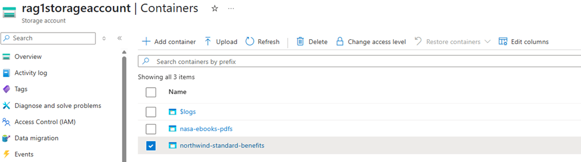
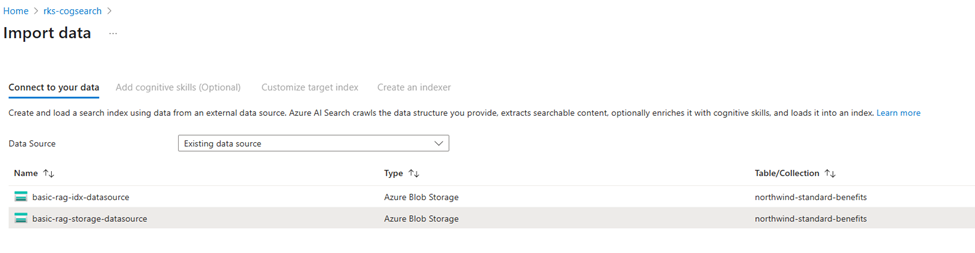
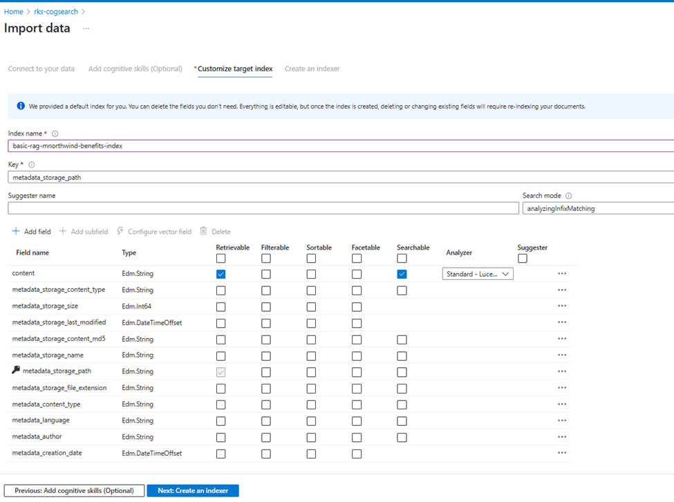
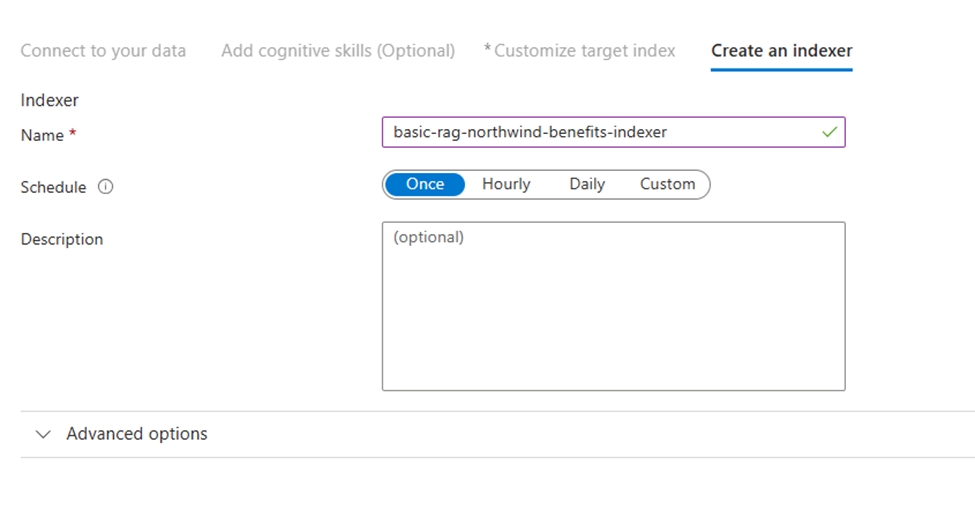
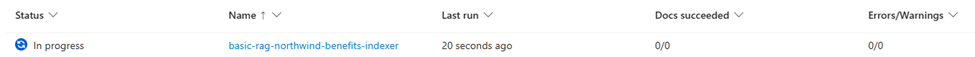
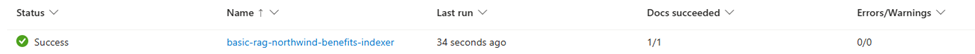
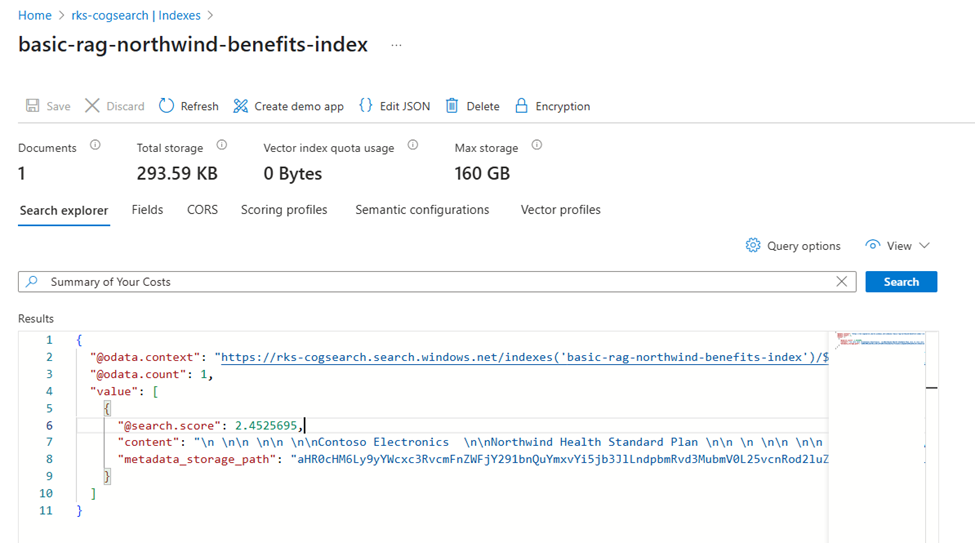
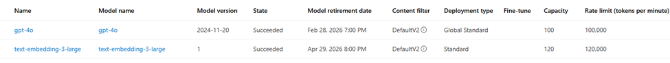

# Step-by-Step Guide: Configuring Azure Blob Storage and Azure AI Search

This guide provides detailed instructions for setting up Azure Blob Storage and Azure AI Search for document processing and search capabilities. This is ideal for first-time users who want to implement basic document search functionality.

## Prerequisites

Before you begin, ensure you have:

1. An Azure account with an active subscription
2. Sufficient permissions to create resources in Azure
3. Access to the Azure Portal (https://portal.azure.com)

## Part 1: Setting up Azure Blob Storage

### Step 1: Create a Storage Account

1. Sign in to the [Azure Portal](https://portal.azure.com)
2. Click on "Create a resource"
3. Search for "Storage account" and select it
4. Click "Create"
5. Fill in the required information:
   - Subscription: Select your subscription
   - Resource Group: Create new or select existing
   - Storage account name: Enter a unique name (lowercase letters and numbers only)
   - Region: Select a region close to your users
   - Performance: Standard
   - Redundancy: Locally redundant storage (LRS)

[Screenshot: Creating Storage Account]

### Step 2: Configure Blob Storage

1. Once the storage account is created, go to the resource
2. In the left menu, under "Data storage", click "Containers"
3. Click "+ Container"
4. Create a new container:
   - Name: Choose a name for your container (e.g., "documents")
   - Public access level: Private

[Screenshot: Creating Container]

### Step 3: Upload Documents

1. Click on your newly created container
2. Click "Upload"
3. Select your documents or drag and drop them
4. Click "Upload"

## Part 2: Setting up Azure AI Search

### Step 1: Create Azure AI Search Service

1. In the Azure Portal, click "Create a resource"
2. Search for "Azure AI Search" and select it
3. Click "Create"
4. Fill in the required information:
   - Subscription: Same as storage account
   - Resource Group: Same as storage account
   - Service name: Enter a unique name
   - Location: Same region as storage account
   - Pricing tier: Basic (or Standard for production use)

[Screenshot: Creating Search Service]

### Step 2: Import Data

1. Go to your Azure AI Search service
2. Click "Import data"
3. Choose data source:
   - Data Source: Azure Blob Storage
   - Data source name: Give it a name
   - Connection string: Copy from your storage account
   - Container: Select your container
   - Authentication type: Connection string

### Step 3: Configure Cognitive Skills (Optional)

1. In the Import data wizard:
   - Add cognitive skills: Choose desired skills
   - Attach AI Services: Create or select existing
   - Save enrichments: Choose destination

[Screenshot: Cognitive Skills Configuration]

### Step 4: Customize Index

1. Configure index fields:
   - Key: Select unique identifier
   - Retrievable: Select fields to return in search
   - Filterable: Enable filtering on specific fields
   - Sortable: Enable sorting
   - Facetable: Enable faceted navigation
   - Searchable: Enable full-text search

### Step 5: Create an Indexer

1. Review indexer settings:
   - Name: Give it a descriptive name
   - Schedule: Set to run once or on schedule
   - Advanced options: Configure as needed
2. Click "Submit" to create and run the indexer

3. Validate Indexer:

Validate after few seconds... 

## Testing Your Setup

### Testing Blob Storage

1. In your storage account:
   - Go to your container
   - Verify uploaded documents are visible
   - Try downloading a document

### Testing Search Service

1. In your Azure AI Search service:
   - Go to "Search explorer"
   - Try a simple search query: `*`
   - Try field-specific queries
   - Review results

[Screenshot: Search Explorer]

## Part 3: Setting up Azure OpenAI

Follow below url to create Azure OpenAI.

https://learn.microsoft.com/en-us/azure/ai-services/openai/how-to/create-resource?pivots=web-portal

Validation: 

Copy the configuration details of AI Search, Azure OpenAI and update your .env file.

You are all set to execute the RAG code now.

## Additional Resources

- [Azure Blob Storage Documentation](https://learn.microsoft.com/en-us/azure/storage/blobs/)
- [Azure AI Search Documentation](https://learn.microsoft.com/en-us/azure/search/)
- [Azure Storage Explorer](https://azure.microsoft.com/en-us/features/storage-explorer/)
- [Azure AI Search REST APIs](https://learn.microsoft.com/en-us/rest/api/searchservice/)

