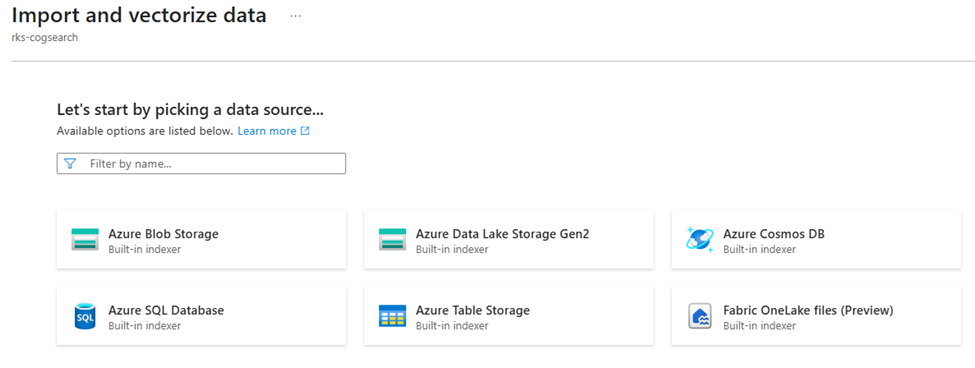
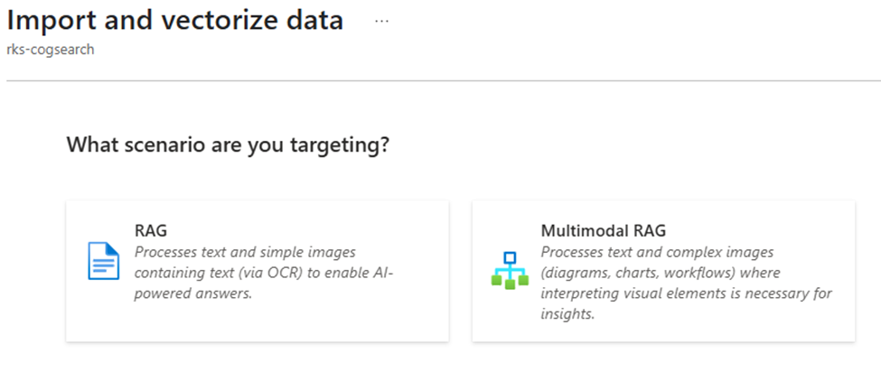
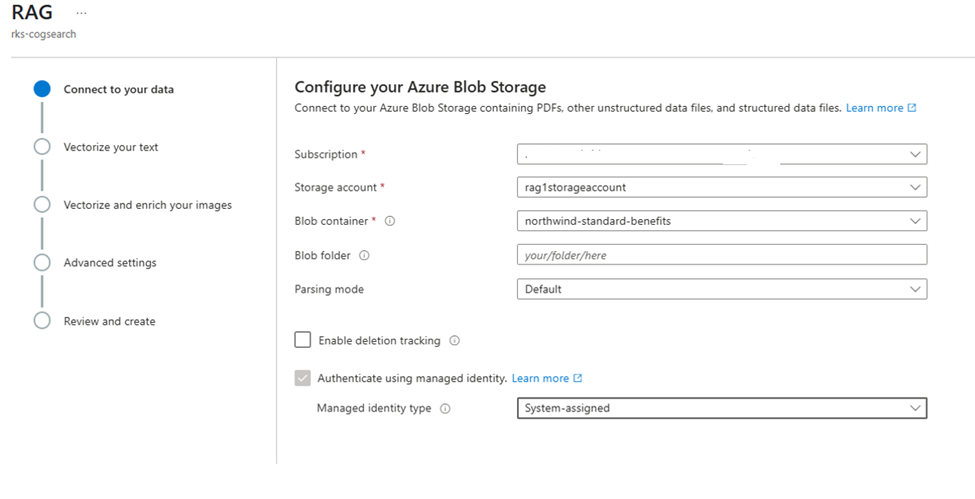
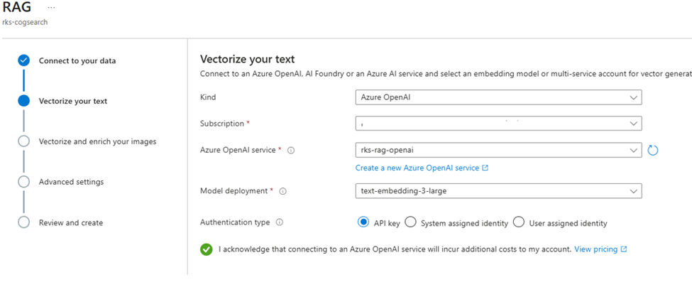
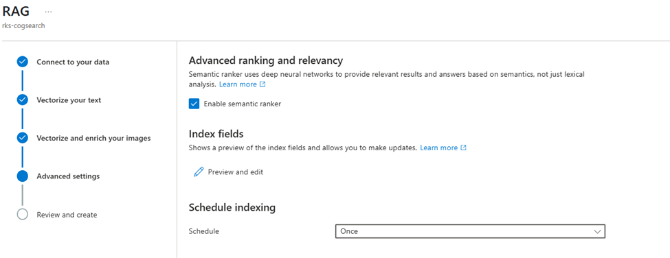
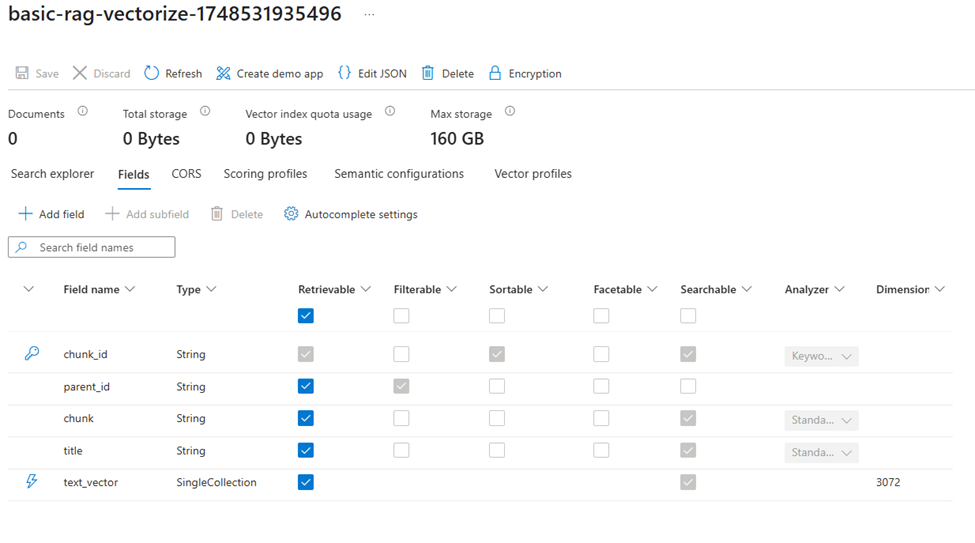
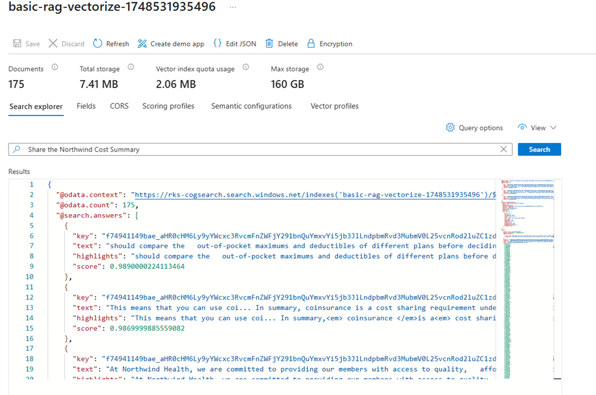

# Configuring Azure AI Search with Vectorization - Step by Step Guide

This guide provides detailed instructions for setting up Azure AI Search with vectorization capabilities, which is essential for implementing advanced RAG (Retrieval-Augmented Generation) patterns.

## Prerequisites

Before you begin, ensure you have:
1. An Azure account with an active subscription
2. Access to the Azure Portal (https://portal.azure.com)
3. A storage account with documents uploaded (refer to [Basic Setup Guide](1.Configure-Azure-Storage-and-Search-readme.md))

## Understanding Vectorization in Azure AI Search

### Why Use "Import and Vectorize Data"?

The "Import and Vectorize data" feature provides several advantages over the basic "Import data" option:

1. **Integrated Vector Creation**: Automatically generates vector embeddings during indexing
2. **Optimized for RAG**: Built-in support for RAG patterns
3. **Simplified Setup**: No need for custom skillsets for vector generation
4. **Cost-Effective**: Optimized vector generation and storage
5. **Better Performance**: Optimized vector search capabilities

## Step-by-Step Configuration

### 1. Create or Use Azure AI Search Service

#### Option A: Create New Service
1. Go to [Azure Portal](https://portal.azure.com)
2. Click "Create a resource"
3. Search for "Azure AI Search"
4. Select a pricing tier that supports vectorization (Standard or above)
5. Complete the creation process

#### Option B: Use Existing Service
- Ensure your existing service supports vectorization (Standard tier or above)
- Vector search capability must be enabled

### 2. Configure Vector Search

1. Navigate to your Azure AI Search service
2. Click "Import and Vectorize data" (NOT "Import data")
3. Follow the wizard steps:

#### Step 2.1: Connect to Your Data
- Select data source type (e.g., Azure Blob Storage)
- Enter connection details
- Choose the container with your documents

[Screenshot: Connect Data Source]

#### Step 2.2: Select RAG Scenario
Two options available:
1. **RAG**: Basic text-based retrieval
2. **Multimodal RAG**: Includes image processing capabilities

[Screenshot: RAG Scenario Selection]

#### Step 2.3: Configure Vectorization
1. **Connect your data**:
   

2. **Vector Settings**:
   - Model: Choose embedding model
   - Vector size: Typically 1536 for most models
   - Similarity algorithm: Cosine similarity (default)

[Screenshot: Vectorization Configuration]

3. **Advance settings: Ranking and relevancyVector Settings**:
   - Enable Semantic ranking
   

#### Step 2.4: Configure Index

Review the generated index fields:
- Standard fields (content, metadata)
- Vector fields (text_vector)
- Additional enriched fields

### 3. Understanding the Differences

#### Index Structure Comparison

Without Vectorization | With Vectorization
--- | ---
Basic text fields | Additional vector fields
No embedding fields | text_vector field
Limited search capabilities | Enhanced semantic search

[Screenshot: Index Comparison]

#### Search Explorer Differences

1. **Basic Search**:
   - Keyword-based
   - Exact matching
   - Basic relevance scoring

2. **Vector Search**:
   - Semantic understanding
   - Similarity matching
   - Neural ranking
   - Hybrid search capabilities

[Screenshot: Search Explorer Comparison]

## Validation and Testing

### 1. Verify Index Creation
1. Go to "Indexes" in your search service
2. Check for vector-specific fields
3. Verify embedding model configuration

### 2. Test Vector Search
1. Open "Search Explorer"
2. Try semantic queries
3. Compare results with traditional search

### 3. Monitor Performance
1. Check indexing status
2. Review vector generation metrics
3. Monitor query performance

## Best Practices

1. **Data Preparation**:
   - Clean and normalize text
   - Remove duplicates
   - Structure content appropriately

2. **Vector Search Configuration**:
   - Use appropriate vector dimensions
   - Configure proper similarity metrics
   - Optimize for your use case

3. **Performance Optimization**:
   - Monitor resource usage
   - Adjust vector parameters
   - Use hybrid search when appropriate

## Troubleshooting

Common issues and solutions:

1. **Vectorization Failures**:
   - Check input data format
   - Verify service tier compatibility
   - Review error logs

2. **Search Issues**:
   - Validate vector configurations
   - Check query formatting
   - Review similarity thresholds

## Next Steps

After configuration:
1. Implement vector search queries
2. Optimize search results
3. Monitor and fine-tune performance
4. Integrate with your applications

## Additional Resources

- [Azure AI Search Vector Documentation](https://learn.microsoft.com/en-us/azure/search/vector-search-overview)
- [Vector Search Best Practices](https://learn.microsoft.com/en-us/azure/search/vector-search-how-to-query)
- [RAG Pattern Implementation](https://learn.microsoft.com/en-us/azure/search/retrieval-augmented-generation-overview)
