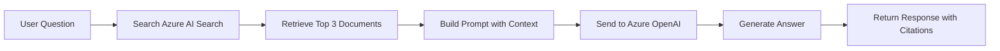

# Lab 3: Your First ChatBot with RAG

Welcome to Lab 3! 
In this lab, you'll build your first Retrieval-Augmented Generation (RAG) chatbot that retrieves relevant documents and generates contextual responses.

## 🎯 Lab Objectives

By the end of this lab, you will:
- Understand RAG concepts: Retrieval → Augmentation → Generation
- Connect to Azure AI Search and query indexed documents
- Implement keyword-based document retrieval
- Combine retrieved context with Azure OpenAI for generation
- Build an interactive RAG-powered chatbot
- Add source citations to AI responses

## 📚 What is RAG?

**Retrieval-Augmented Generation (RAG)** is a technique that improves AI responses by:
1. **Retrieval**: Finding relevant documents from a knowledge base
2. **Augmentation**: Adding retrieved content to the prompt
3. **Generation**: Using an LLM to generate answers based on the retrieved context

**Why RAG?**
- Provides up-to-date information beyond the model's training data
- Reduces hallucinations by grounding responses in actual documents
- Enables AI to work with your specific domain knowledge
- Allows citation of sources for transparency

**Learn more:** [RAG Overview - Microsoft Learn](https://learn.microsoft.com/en-us/azure/search/retrieval-augmented-generation-overview?tabs=docs)

## 📋 Prerequisites

- Complete Lab 1 (Azure Services set up)
- Complete Lab 2 (Azure OpenAI basics)
- Azure AI Search index with documents already indexed
- Python 3.8+ installed
- Virtual environment activated

## 🚀 Lab Tasks

### Task 1: Set Up Azure AI Search Index

Before running the code, ensure you have:
1. Documents uploaded to Azure Blob Storage
2. Created an index in Azure AI Search
3. Run an indexer to process and index the documents

> **Note**: If you haven't set up indexing yet, follow these guides:
> - **[1.Configure-Azure-Storage-and-Search-readme.md](1.Configure-Azure-Storage-and-Search-readme.md)** - Set up Azure Blob Storage and create a basic Azure AI Search index with document importing
> - **[2.Configure Azure AI Search-vectorize-readme.md](2.Configure%20Azure%20AI%20Search-vectorize-readme.md)** - Configure advanced vectorization for semantic search with embeddings (required for hybrid search)

### Task 2: Install Dependencies

```powershell
cd Lab3
python -m venv venv
.\venv\Scripts\Activate.ps1
pip install -r requirements.txt
```

### Task 3: Configure Environment Variables

1. Copy `example.env` to `.env`
2. Update with your credentials:

```env
# Azure OpenAI Configuration
AZURE_OPENAI_ENDPOINT=https://your-resource.openai.azure.com/
AZURE_OPENAI_API_KEY=your_api_key_here
AZURE_OPENAI_MODEL_NAME=gpt-4o

# Azure AI Search Configuration
AZURE_SEARCH_ENDPOINT=https://your-search.search.windows.net
AZURE_SEARCH_KEY=your_search_key_here
AZURE_SEARCH_INDEX_NAME=your-index-name
```

### Task 4: Understand the RAG Workflow

The lab includes three progressive scripts:

#### Script 1: Search Foundation (`1.GetResults-from-SearchEngine.py`)
Learn how to query Azure AI Search and retrieve relevant documents.

**What it does:**
- Connects to Azure AI Search
- Performs hybrid search (keyword + vector)
- Returns the most relevant document chunks

**Run it:**
```powershell
python RAG/1.GetResults-from-SearchEngine.py
```

**Key concepts:**
- Vector search using embeddings
- k-nearest neighbors (KNN) search
- Relevance scoring

#### Script 2: Simple RAG (`2.simple_rag.py`)
Basic RAG implementation with a hardcoded question.

**What it does:**
1. Searches for relevant documents
2. Retrieves top 3 most relevant chunks
3. Passes context to Azure OpenAI
4. Generates a grounded response

**Run it:**
```powershell
python RAG/2.simple_rag.py
```

**Key concepts:**
- Combining retrieval with generation
- Prompt engineering for grounded responses
- Source attribution

#### Script 3: Interactive RAG (`3.simple_rag_interactive.py`)
Full interactive RAG chatbot you can query in real-time.

**What it does:**
- Accepts user questions interactively
- Performs search for each question
- Generates contextual responses
- Displays source citations

**Run it:**
```powershell
python RAG/3.simple_rag_interactive.py
```

**Try these questions:**
- "What are the benefits of the Northwind Standard plan?"
- "How much does the Northwind Plus plan cost?"
- "What is included in the Northwind Basic plan?"


## 📁 Project Structure

```
Lab3/
├── Readme.md                                    # This file - Lab instructions
├── 1.Configure-Azure-Storage-and-Search-readme.md  # Storage setup guide
├── 2.Configure Azure AI Search-vectorize-readme.md # Vectorization guide
├── requirements.txt                             # Python dependencies
├── example.env                                  # Template for environment
├── .env                                        # Your credentials (create this)
├── documents/                                   # Sample documents
├── images/                                      # Screenshots and diagrams
└── RAG/
    ├── 1.GetResults-from-SearchEngine.py       # Search foundation
    ├── 2.simple_rag.py                         # Basic RAG demo
    └── 3.simple_rag_interactive.py             # Interactive RAG chatbot
```

## 🔍 How It Works



## ✅ Lab Completion Checklist

- [ ] Azure AI Search index is set up and populated
- [ ] Installed dependencies and configured `.env`
- [ ] Successfully ran `1.GetResults-from-SearchEngine.py`
- [ ] Successfully ran `2.simple_rag.py` and got a response
- [ ] Successfully ran `3.simple_rag_interactive.py`
- [ ] Asked multiple questions and received accurate answers
- [ ] Understood the RAG workflow (Retrieve → Augment → Generate)


## 🎓 What You Learned

- RAG fundamentals: Retrieval, Augmentation, Generation
- How to query Azure AI Search from Python
- Keyword-based document retrieval
- Combining search results with LLM prompts
- Building interactive AI chatbots
- Source attribution best practices

## 📊 Simple vs. Advanced RAG

This lab covered **Simple RAG** using keyword search. In the next lab, you'll learn:

| Feature | Lab 3 (Simple) | Lab 4 (Advanced) |
|---------|---------------|------------------|
| Search Type | Keyword only | Hybrid (Keyword + Vector) |
| Semantic Understanding | Limited | Excellent |
| Handles Synonyms | ❌ | ✅ |
| Production Ready | Demo | Enterprise |

## 📚 Additional Resources

- [Azure AI Search Documentation](https://learn.microsoft.com/azure/search/)
- [What is RAG?](https://learn.microsoft.com/azure/search/retrieval-augmented-generation-overview)
- [Azure OpenAI RAG Best Practices](https://learn.microsoft.com/azure/ai-services/openai/concepts/use-your-data)

## ➡️ Next Steps

Ready to take your RAG to the next level?
- **[Lab 4: Advanced RAG](../Lab4/README.md)** - Learn hybrid search with vector embeddings!

---

**🎉 Congratulations on building your first RAG chatbot!**