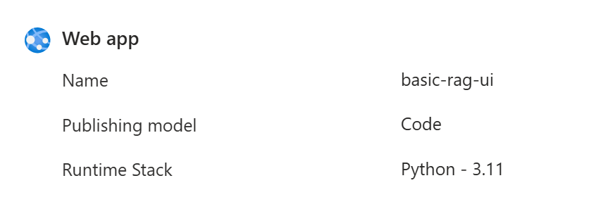

# Deploying RAG Chatbot to Azure App Service

This guide provides step-by-step instructions for deploying the Northwind Benefits RAG Chatbot to Azure App Service.

## Prerequisites

- Azure subscription
- Azure CLI installed
- VS Code with Azure App Service extension installed
- Git repository with your RAG application
- `.env` file with all required configuration

## Option 1: Deploy using Visual Studio Code

### 1. Prepare Your Application

1. Update your `requirements.txt`:
   ```txt
   azure-search-documents>=11.4.0
   openai>=1.6.1
   python-dotenv>=1.0.0
   gradio>=4.12.0
   azure-core>=1.29.5
   azure-identity>=1.15.0
   ```

2. Add a `startup.txt` file in your project root:
   ```txt
   gunicorn app:demo
   ```


### 2. Create Azure App Service

1. Open VS Code
2. Click on the Azure icon in the activity bar
3. Under "App Services", click the "+" icon
4. Select "Create New Web App"
5. Enter a globally unique name (e.g., "northwind-benefits-rag")
6. Select Python 3.11
7. Choose pricing tier (B1 or higher recommended)
8. Choose your region



### 3. Configure App Settings

In the Azure portal:

1. Go to your App Service
2. Navigate to "Configuration" under "Settings"
3. Add the following application settings (replacing with your values):

```
AZURE_SEARCH_ENDPOINT=your-search-endpoint
AZURE_SEARCH_KEY=your-search-key
AZURE_SEARCH_INDEX=your-index-name
AOAI_DEPLOYMENT=your-gpt-deployment
AOAI_KEY=your-openai-key
AOAI_ENDPOINT=your-openai-endpoint
AOAI_API_VERSION=2024-02-15-preview
AOAI_EMBEDDING_MODEL=text-embedding-3-large
SCM_DO_BUILD_DURING_DEPLOYMENT=true
PYTHON_ENV=production
```

or use the below script:
```
az webapp config appsettings set --resource-group "your-resource-group-name" --name "your-webapp-name" --settings AZURE_SEARCH_ENDPOINT="your-search-service-url" AZURE_SEARCH_KEY="your-search-admin-key" AZURE_SEARCH_INDEX="your-search-index-name" AOAI_DEPLOYMENT="your-gpt-deployment-name" AOAI_KEY="your-openai-key" AOAI_ENDPOINT="your-openai-service-url" AOAI_API_VERSION="your-api-version" AOAI_EMBEDDING_MODEL="your-embedding-model-name" SCM_DO_BUILD_DURING_DEPLOYMENT="true" PYTHON_ENV="production"
```

### 4. Deploy from VS Code

1. Right-click your App Service in VS Code
2. Select "Deploy to Web App"
3. Choose your project folder
4. Wait for deployment to complete
5. Open the application URL

## Option 2: Deploy using Azure CLI

### 1. Create Resource Group and App Service Plan

```powershell
# Variables
$RESOURCE_GROUP="rg-northwind-rag"
$LOCATION="eastus"
$APP_SERVICE_PLAN="asp-northwind-rag"
$APP_NAME="northwind-benefits-rag"

# Create Resource Group
az group create --name $RESOURCE_GROUP --location $LOCATION

# Create App Service Plan
az appservice plan create `
    --name $APP_SERVICE_PLAN `
    --resource-group $RESOURCE_GROUP `
    --sku B1 `
    --is-linux
```

### 2. Create Web App

```powershell
# Create Web App
az webapp create `
    --resource-group $RESOURCE_GROUP `
    --plan $APP_SERVICE_PLAN `
    --name $APP_NAME `
    --runtime "PYTHON:3.11" `
    --startup-file "startup.txt"
```

### 3. Configure App Settings from .env File

```powershell
# Read .env file and configure app settings
$envContent = Get-Content .env
foreach ($line in $envContent) {
    if ($line -match '(.+?)=(.+)') {
        $key = $matches[1]
        $value = $matches[2]
        az webapp config appsettings set `
            --resource-group $RESOURCE_GROUP `
            --name $APP_NAME `
            --settings "$key=$value"
    }
}
```

### 4. Deploy Application

```powershell
# Deploy from local git repository
az webapp deployment source config-local-git `
    --name $APP_NAME `
    --resource-group $RESOURCE_GROUP

# Get deployment URL
$DEPLOYMENT_URL = az webapp deployment list-publishing-profiles `
    --name $APP_NAME `
    --resource-group $RESOURCE_GROUP `
    --query "[?publishMethod=='MSDeploy'].publishUrl" -o tsv

# Add Azure as remote and push
git remote add azure $DEPLOYMENT_URL
git push azure main
```

## Additional Configuration

### Custom Domain Setup (Optional)

1. Go to App Service
2. Navigate to "Custom domains"
3. Click "Add custom domain"
4. Follow the DNS verification process

### Enable Logging

1. Go to App Service
2. Navigate to "App Service logs"
3. Enable "Application logging"
4. Set retention period

### Monitoring

1. Go to App Service
2. Navigate to "Application Insights"
3. Enable Application Insights
4. Configure alerts for:
   - Response time
   - Failed requests
   - Server errors

### Scale Up/Out (as needed)

1. Go to App Service
2. For vertical scaling: Navigate to "Scale up (App Service plan)"
3. For horizontal scaling: Navigate to "Scale out (App Service plan)"

## Troubleshooting

### Common Issues

1. **Application Not Starting**
   - Check startup command in `startup.txt`
   - Review application logs
   - Verify all environment variables are set

2. **Memory Issues**
   - Consider scaling up to a higher tier
   - Check for memory leaks
   - Monitor memory usage in metrics

3. **Slow Response Times**
   - Enable Always On
   - Check Azure OpenAI service response times
   - Monitor CPU usage

### Viewing Logs

```powershell
# Stream logs
az webapp log tail --name $APP_NAME --resource-group $RESOURCE_GROUP

# Download logs
az webapp log download --name $APP_NAME --resource-group $RESOURCE_GROUP
```

## Production Best Practices

1. **Security**
   - Enable HTTPS only
   - Use Azure Key Vault for secrets
   - Implement authentication if needed
   - Configure CORS appropriately

2. **Performance**
   - Enable compression
   - Configure caching
   - Use CDN for static content

3. **Monitoring**
   - Set up alerts
   - Monitor resource usage
   - Configure diagnostic settings

4. **Backup**
   - Enable automatic backups
   - Configure backup frequency
   - Test restore procedures


## Common Deployment Issues:

### 1. Python Version Error
If you encounter this error:
```
Version '3.11.12' of platform 'python' is not installed
Detecting platforms...
Detected following platforms:
  python: 3.11.12
Version '3.11.12' of platform 'python' is not installed. Generating script to install it...
```

**Solution:**

1. Check your local Python version:
```
python --version
```

and modify the Python version in Azure App Service accordingly.
```powershell
# Set the Python version to 3.11
az webapp config set --resource-group "your-resource-group" --name "your-app-name" --linux-fx-version "PYTHON|3.11"
```

2. Or use the Azure Portal:
   - Go to your App Service
   - Navigate to Configuration → General settings
   - Under "Stack settings":
     - Stack: Python
     - Major version: 3.11
     - Minor version: Latest

3. Update your deployment script to specify Python 3.11:
```powershell
az webapp create `
    --resource-group $RESOURCE_GROUP `
    --plan $APP_SERVICE_PLAN `
    --name $APP_NAME `
    --runtime "PYTHON|3.11" `  # Changed from PYTHON:3.11
    --startup-file "startup.txt"
```

