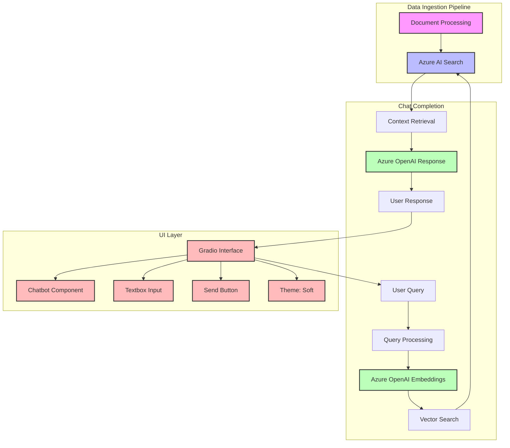
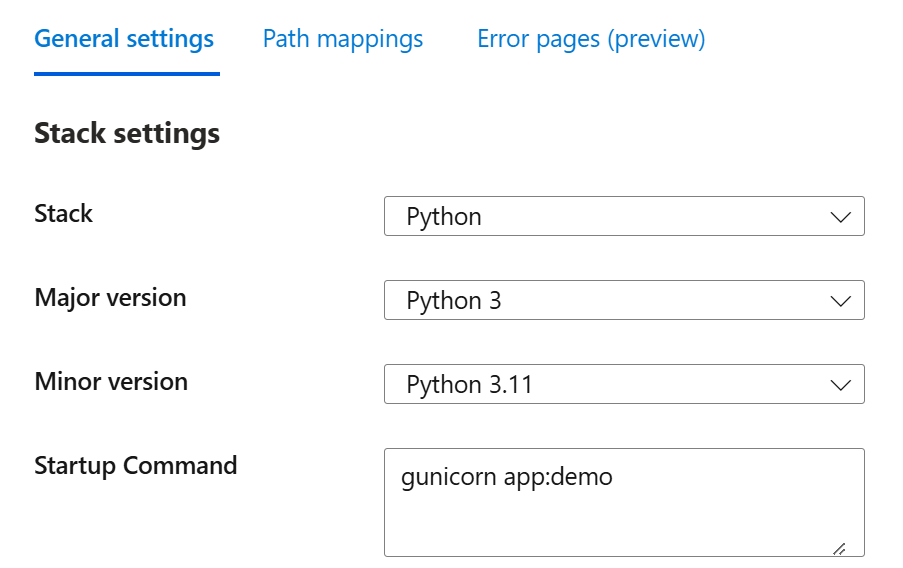

# Lab 5: RAG with a Front end API - Northwind Benefits Chatbot

This lab builds a production-ready Retrieval-Augmented Generation (RAG) chatbot with a professional web interface using Gradio. You'll create a fully functional benefits chatbot with conversation history, citations, and deployment capabilities.

## 🎯 Lab Objectives

By the end of this lab, you will:
- Build a production-ready RAG application with Gradio web UI
- Implement conversation history tracking
- Add citation tracking and source attribution
- Create a professional, user-friendly chat interface
- Learn deployment strategies for Azure App Service
- Understand production readiness best practices

## 📋 Prerequisites

- Completed Lab 3 and Lab 4 (RAG basics and advanced RAG)
- Azure OpenAI resource with deployed models
- Azure AI Search service with indexed documents
- Python 3.8+ installed
- Basic understanding of web applications

## 🚀 Getting Started

### 1. Set up Virtual Environment

```powershell
cd Lab5
python -m venv virtualenv
.\virtualenv\Scripts\Activate.ps1
```

### 2. Install Dependencies

```powershell
pip install -r requirements.txt
```

### 3. Configure Environment Variables

Copy `example.env` to `.env` and update with your credentials:

```env
# Azure OpenAI Configuration
AZURE_OPENAI_ENDPOINT=https://your-resource.openai.azure.com/
AZURE_OPENAI_API_KEY=your_api_key_here
AOAI_DEPLOYMENT=gpt-4o
AOAI_EMBEDDING_MODEL=text-embedding-3-large
AOAI_API_VERSION=2024-02-15-preview

# Azure AI Search Configuration
AZURE_SEARCH_ENDPOINT=https://your-search.search.windows.net
AZURE_SEARCH_KEY=your_search_key_here
AZURE_SEARCH_INDEX=your-index-name
```

### 4. Test Connections (Optional)

Before running the main app, verify your connections:

```powershell
python test_connections.py
```

Expected output:
```
✅ Azure OpenAI connection successful
✅ Azure AI Search connection successful
✅ All services are ready!
```

### 5. Run the Application

```powershell
python app.py
```

The application will start and automatically open in your default browser at `http://localhost:7860`

### 6. Interact with the Chatbot

Once the app is running:
- 🌐 Access the interface at `http://localhost:7860`
- 💭 Type questions in the textbox or click example questions
- 📚 View responses with automatic source citations
- 🔍 Click citations to see source details
- 🧹 Clear conversation history as needed

**Try these example questions:**
- "What are the benefits of the Northwind Standard plan?"
- "How much does the Northwind Plus plan cost?"
- "What health insurance options are available?"
- "Compare the Basic and Standard plans"

---

## 📁 Project Structure

```
Lab5/
├── readme.md                   # This file - Lab instructions
├── app.py                      # Main Gradio application
├── test_connections.py         # Connection verification script
├── requirements.txt            # Python dependencies
├── example.env                 # Template for environment variables
├── .env                       # Your credentials (create this)
├── deploy-to-azure.md         # Azure deployment guide
├── startup.txt                # Azure App Service startup config
├── restart_app.py             # App restart utility
├── images/                    # Screenshots and UI images
├── scripts/
│   └── configure-webapp-env.ps1  # Azure Web App configuration script
└── virtualenv/                # Python virtual environment (created)
```

---

## 🎨 Northwind Benefits RAG Chatbot - Features

This is a specialized Retrieval-Augmented Generation (RAG) implementation focused on Northwind Benefits information. It provides a user-friendly chat interface built with Gradio, leveraging Azure AI Search for intelligent document retrieval and Azure OpenAI for generating accurate, contextual responses.

The application is a Gradio-based web interface for a RAG (Retrieval-Augmented Generation) chatbot. Here are the key components:

**Web Framework**: Uses Gradio (version 4.19.0 or higher) for the web interface  
**Web Server**: Uses Gunicorn as the WSGI server for deployment

## Features
- 🔍 Vector-based document search using Azure AI Search
- 🤖 Contextual response generation using Azure OpenAI
- 💬 Simple and intuitive chat interface with Gradio
- 📊 Conversation history tracking
- 📝 Clear source citations in responses
- 🎯 Curated example questions about benefits
- 🔄 Hybrid search combining semantic and vector approaches
- 📑 Support for multiple document formats (PDF, etc.)
- 🎨 Clean and professional UI with Soft theme

---

## �️ Technical Architecture



> **Note**: This diagram shows the complete system architecture:
> 1. **Data Ingestion Pipeline**: Processes and indexes documents in Azure AI Search
> 2. **Chat Completion**: Handles query processing, vector search, and response generation
> 3. **UI Layer**: Built with Gradio framework, featuring:
>    - Chatbot component for conversation history
>    - Textbox for user input
>    - Send button for query submission
>    - Soft theme for modern look and feel
>
---

## 🔧 Key Implementation Details

### Key Components
- **Vector Search**: Uses k-nearest neighbors (KNN) with cosine similarity
- **Hybrid Search**: Combines vector and keyword-based search
- **Citation System**: Automatic source attribution with clickable references
- **Memory Management**: Conversation history tracking with context
- **Error Handling**: Robust error management with user-friendly messages

---

## 🚀 Deployment Options

### Local Development
- Runs on localhost:7860 by default
- Supports external access configuration
- Environment variables via .env file

**Output Example:**



### Azure App Service Deployment
1. Create an Azure App Service (Python)
2. Configure environment variables in App Service settings
3. Deploy using one of these methods:
   - Azure CLI
   - GitHub Actions
   - VS Code Azure Extension
4. Configure CORS if needed
5. Set up application monitoring

**For detailed step-by-step guide:** [Azure Deployment Guide](deploy-to-azure.md)

---

## 🔐 Security Best Practices

### Security Notes
- Keep API keys secure in environment variables
- Use Azure Key Vault for production deployments
- Consider implementing authentication for production use
- Review and update CORS settings as needed

---

## ✅ Lab Completion Checklist

- [ ] Successfully set up virtual environment
- [ ] Installed all dependencies without errors
- [ ] Configured `.env` file with Azure credentials
- [ ] Tested connections to Azure services
- [ ] Successfully launched the Gradio application
- [ ] Asked questions and received accurate responses
- [ ] Understood conversation history management
- [ ] Explored citation and source attribution features
- [ ] Reviewed deployment options for production

---

## 🆘 Troubleshooting

**Issue**: Application won't start
- **Solution**: Check that all environment variables are set correctly in `.env`
- Verify Python virtual environment is activated
- Ensure all dependencies are installed: `pip install -r requirements.txt`

**Issue**: No search results or empty responses
- **Solution**: Verify Azure AI Search index has data
- Check `AZURE_SEARCH_INDEX` name matches your actual index
- Run `test_connections.py` to verify connectivity

**Issue**: Port 7860 already in use
- **Solution**: Kill the existing process or change the port in `app.py`:
  ```python
  demo.launch(server_port=7861)  # Use a different port
  ```

**Issue**: Citation links not working
- **Solution**: Ensure your indexed documents have proper `title` fields
- Check that document sources are properly formatted

**Issue**: Slow responses
- **Solution**: Reduce `top` parameter in search queries
- Consider upgrading Azure OpenAI deployment capacity
- Check network connectivity to Azure services

---

## 🎓 What You Learned

- Building production-ready RAG applications with web interfaces
- Implementing Gradio for interactive AI applications
- Managing conversation history and context
- Adding source citations for transparency
- Deploying AI applications to Azure App Service
- Production readiness best practices:
  - Security and credential management
  - Error handling and user experience
  - Scalability considerations
  - Monitoring and observability

---

## 📚 Additional Resources

- [Gradio Documentation](https://www.gradio.app/docs)
- [Azure App Service Documentation](https://learn.microsoft.com/azure/app-service/)
- [Azure OpenAI Best Practices](https://learn.microsoft.com/azure/ai-services/openai/concepts/best-practices)
- [RAG Architecture Patterns](https://learn.microsoft.com/azure/architecture/ai-ml/guide/rag-solution-design-and-evaluation-guide)

---

## ➡️ Next Steps

Ready to explore AI Agents?
- **[Lab 6: Create your First Agent in AI Foundry](../Lab6/README.md)** - Learn to build intelligent agents with tool calling!

---

**🎉 Congratulations on building a production-ready RAG application!**


